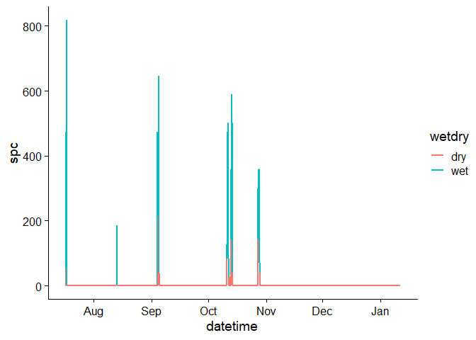
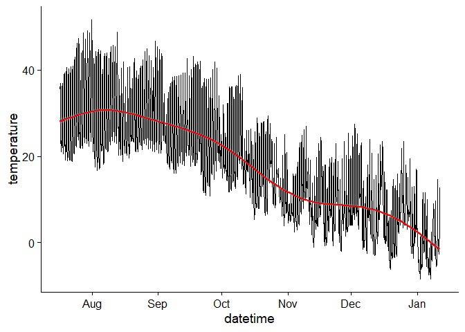

konza\_datajam\_markdown
================
Christopher Wheeler
4/7/2022

## STIC Processing Workflow

``` r
library(tidyverse)
library(cowplot)
library(dygraphs)
library(patchwork)
library(sf)
```

I have developed some generalized functions for tidying and preliminary
processing of STIC data that I intend to make into a package. Code for
the functions is below:

The first function loads raw HOBO STIC files and cleans up columns and
headers to produce a tidy data frame and/or CSV output.

infile = filename (including path if needed) for the raw HOBO data on
your computer.

outfile = filename (including path if needed) to save the tidied.
Defaults to FALSE, in which case tidied data will not be saved.

``` r
source("tidy_hobo_data.R")
```

This next function (get\_calibration.R) is a function to fit standard
and measured calibration data to model a object (lm and exponential to
start)

inputs: data frame with columns “standard” and “conductivity\_uncal” and
method = “linear” or “exponential”

output: fitted model object

input needs to be data frame. column names: conductivity\_uncal,
standard

``` r
source("get_calibration.R")
```

The next function is called apply\_calibration.R

inputs: calibration (a model object) and a data frame with columns
labeled “datetime”, “temperature” “conductivity\_uncal”

output: same data frame as input, except with a new column called “spc”

``` r
source("apply_calibration.R")
```

Last function is classify\_wetdry.R

inputs: data frame with columns “datetime”, “temperature”,
“conductivity”, and “specific\_conductivity”

output: same data frame as input, but with a new column called wetdry

``` r
source("classify_wetdry.R")
```

## Examples of the use of STICr functions

Here is how they work:

First we are bringing in and tidying raw HOBO data by giving the
function a filepath. In this example it is Youngmeyer STIC ENM312 from
July to February

``` r
stic_data <- tidy_hobo_data("C:/Users/cwhee/Desktop/R_Directory/AIMS_hydro_qaqc/youngmeyer_stics_round_1/21038945_ENM312.csv")

head(stic_data)
```

    ##              datetime conductivity_uncal temperature
    ## 1 2021-07-16 17:00:00              139.9      35.435
    ## 2 2021-07-16 17:15:00               86.1      36.837
    ## 3 2021-07-16 17:30:00               96.9      34.374
    ## 4 2021-07-16 17:45:00              139.9      33.639
    ## 5 2021-07-16 18:00:00              118.4      33.953
    ## 6 2021-07-16 18:15:00              150.7      32.497

Next we are bringing in a set of calibration points and creating a
fitted model object. In this case, the model type we chose is linear

``` r
cal_points <- read_csv("cal_points.csv")
```

    ## 
    ## -- Column specification --------------------------------------------------------
    ## cols(
    ##   std_val = col_double(),
    ##   measured_val = col_double()
    ## )

``` r
cal_points <- cal_points %>% 
  rename(standard = std_val) %>% 
  rename(conductivity_uncal = measured_val)

calibration_data <- cal_points

calibration <- get_calibration(calibration_data, method = "linear")

summary(calibration)
```

    ## 
    ## Call:
    ## lm(formula = standard ~ conductivity_uncal, data = calibration_data)
    ## 
    ## Residuals:
    ##       1       2       3       4 
    ##   73.77  -50.25 -146.38  122.87 
    ## 
    ## Coefficients:
    ##                      Estimate Std. Error t value Pr(>|t|)  
    ## (Intercept)        -2.766e+02  1.853e+02  -1.493   0.2740  
    ## conductivity_uncal  1.047e-02  2.402e-03   4.357   0.0488 *
    ## ---
    ## Signif. codes:  0 '***' 0.001 '**' 0.01 '*' 0.05 '.' 0.1 ' ' 1
    ## 
    ## Residual standard error: 149.1 on 2 degrees of freedom
    ## Multiple R-squared:  0.9047, Adjusted R-squared:  0.8571 
    ## F-statistic: 18.99 on 1 and 2 DF,  p-value: 0.04884

Now Step 3: Apply calibration. The function take the current data frame
and model object, then adds a new “real” spc column to data frame

``` r
stic_data_with_spc <- apply_calibration(stic_data, calibration)

head(stic_data_with_spc)
```

    ##              datetime conductivity_uncal temperature       spc
    ## 1 2021-07-16 17:00:00              139.9      35.435 -275.1632
    ## 2 2021-07-16 17:15:00               86.1      36.837 -275.7264
    ## 3 2021-07-16 17:30:00               96.9      34.374 -275.6133
    ## 4 2021-07-16 17:45:00              139.9      33.639 -275.1632
    ## 5 2021-07-16 18:00:00              118.4      33.953 -275.3883
    ## 6 2021-07-16 18:15:00              150.7      32.497 -275.0502

Final step: using the classify\_wetdry function to create another column
with the binary, classified data. Default threshold is 1000 for
conductivity\_uncal

``` r
classified <- classify_wetdry(stic_data_with_spc, threshold = 50)

head(classified)
```

    ##              datetime conductivity_uncal temperature       spc wetdry
    ## 1 2021-07-16 17:00:00              139.9      35.435 -275.1632    dry
    ## 2 2021-07-16 17:15:00               86.1      36.837 -275.7264    dry
    ## 3 2021-07-16 17:30:00               96.9      34.374 -275.6133    dry
    ## 4 2021-07-16 17:45:00              139.9      33.639 -275.1632    dry
    ## 5 2021-07-16 18:00:00              118.4      33.953 -275.3883    dry
    ## 6 2021-07-16 18:15:00              150.7      32.497 -275.0502    dry

Last thing: we need to change “negative” calibrated spc values to 0

``` r
classified$spc <- ifelse(classified$spc < 0, 0, classified$spc)
```

## What does this data (for one stic) look like

Here is the uncalibrated conductivity time series:

``` r
ggplot(classified, aes(x = datetime, y = spc, color = wetdry, group = 1)) +
  geom_path(size = 1) + 
  theme_cowplot()
```

<!-- -->

Here is a temperature time series

``` r
ggplot(classified, aes(x = datetime, y = temperature)) +
  geom_path() + 
  geom_smooth(color = "red") +
  theme_cowplot()
```

    ## `geom_smooth()` using method = 'gam' and formula 'y ~ s(x, bs = "cs")'

<!-- -->

Here is some code showing how to bring all the STIC locations in and
calculate metrics:

``` r
library(fs)
library(Rcpp)
library(sp)
library(raster)
library(rgdal)
library(rasterVis)
library(sf)
```

``` r
data_dir <- "processed_files_youngmeyer"

fs::dir_ls(data_dir)
```

    ## processed_files_youngmeyer/processed_20821662.csv
    ## processed_files_youngmeyer/processed_20946456.csv
    ## processed_files_youngmeyer/processed_20946457.csv
    ## processed_files_youngmeyer/processed_20946462.csv
    ## processed_files_youngmeyer/processed_20946471.csv
    ## processed_files_youngmeyer/processed_20946474.csv
    ## processed_files_youngmeyer/processed_21035971.csv
    ## processed_files_youngmeyer/processed_21035972.csv
    ## processed_files_youngmeyer/processed_21035973.csv
    ## processed_files_youngmeyer/processed_21035974.csv
    ## processed_files_youngmeyer/processed_21035975.csv
    ## processed_files_youngmeyer/processed_21035977.csv
    ## processed_files_youngmeyer/processed_21038939.csv
    ## processed_files_youngmeyer/processed_21038941.csv
    ## processed_files_youngmeyer/processed_21038945.csv
    ## processed_files_youngmeyer/processed_21038946.csv
    ## processed_files_youngmeyer/processed_21038947.csv
    ## processed_files_youngmeyer/processed_21038948.csv
    ## processed_files_youngmeyer/processed_21038952.csv

``` r
length(data_dir)
```

    ## [1] 1

``` r
stic_files <- fs::dir_ls(data_dir, regexp = "\\.csv$")

### using the map_dfr function from tidyverse to loop in individual csvs and bind rows
stic_files <- stic_files %>% 
  map_dfr(read_csv)

### Creating binary wet/dry column based of relative cond value of 1000
stic_files <- stic_files %>% 
  dplyr::mutate(wetdry = if_else(conductivity >= 1000, "wet", "dry" ))

### using lubridate to convert datetime to tidy format 
stic_files <- stic_files %>% 
  mutate(datetime = lubridate::mdy_hms(datetime))

### Cutting off dates to begin at 07/18/2021
stic_files <- stic_files %>% 
  filter(datetime >= "2021-07-18")

### using lubridate to create column with just date rather than datetime 
stic_files <- stic_files %>% 
  mutate(date = lubridate::date(datetime))

### using lubridate to separate out the individual days 
stic_files <- stic_files %>% 
  mutate(day = lubridate::yday(date))


### making a new dataframe with date of first drying for all individual logger
drying <- stic_files %>% 
  subset(wetdry == "dry") %>%
  group_by(logger) %>% 
  summarise(first_dry = min(day)) 

### Now calculating the percentage of wet STICs at each time step
### Calculate wet network proportion

stic_wet_prop <- stic_files %>% 
  group_by(datetime) %>% 
  summarise(n_wet = sum(wetdry == "wet"), n_sensors = n() ) %>% 
  mutate(percent = n_wet/n_sensors)

ggplot(stic_wet_prop, aes(x = datetime, y = percent)) + 
  geom_line(color = "steelblue", size = 1) + 
  ylab("wet network proportion") + 
  theme_cowplot()
```

<!-- -->

``` r
### Calculate flow duration for each sensor
### i,e, percentage of wet observations out of total obs for each logger

stic_duration <- stic_files %>% 
  group_by(logger) %>% 
  summarise(n_wet = sum(wetdry == "wet", na.rm = TRUE), count = n()) %>% 
  mutate(duration = n_wet/count)

ggplot(stic_duration, aes(x = duration)) + 
  geom_histogram(fill = "steelblue") + 
  theme_cowplot() + 
  xlab("flow duration for logger") + 
  ylab("count of loggers")
```

<!-- -->

``` r
ggplot(stic_duration, aes(x = duration)) + 
  geom_density(color = "steelblue", size = 1) + 
  theme_cowplot()
```

<!-- --> Now we
are pairing with a coordinate data frame to create some maps. First we
are just going to map the location of ENM312

``` r
library(tidyverse)
library(tidyr)

youngmeyer_coords <- read_csv("youngmeyer_coords.csv", 
                              col_types = cols(logger = col_number()))

stic_duration$logger <- as.numeric(stic_duration$logger)

duration_coords <- left_join(youngmeyer_coords, stic_duration, by = "logger")

### Make Duration Map


youngmeyer_duration_locs <- st_as_sf(duration_coords,
                                     coords = c("Longitude", "Latitude"), 
                                     crs = 4326)


youngmeyer_cal <- read_csv("youngmeyer_cal.csv", 
                           col_types = cols(logger = col_number()))


young_spc_stic <- left_join(stic_files, youngmeyer_cal, by = "logger")

young_spc_stic <- drop_na(young_spc_stic)

young_spc_stic <- young_spc_stic %>% 
  mutate(spc = conductivity/slope)


young_spc_wet_stic <- young_spc_stic %>% 
  filter(wetdry == "wet")

# generate average cond value
young_ave_cond <- young_spc_wet_stic %>% 
  group_by(logger) %>% 
  summarise(average_spc = mean(spc)) 

# map the mean spc

youngmeyer_coords <- read_csv("youngmeyer_coords.csv", 
                              col_types = cols(logger = col_number()))


spc_coords <- left_join(youngmeyer_coords, young_ave_cond, by = "logger")

### Make SPC Map

youngmeyer_spc_locs <- st_as_sf(spc_coords,
                                coords = c("Longitude", "Latitude"), 
                                crs = 4326)

# Put in stream network shapefile


youngmeyer_streams <- st_read(
  "youngmeyer_shape/Youngmeyer_StreamNetwork.shp")
```

    ## Reading layer `Youngmeyer_StreamNetwork' from data source 
    ##   `C:\Users\cwhee\Desktop\R_Directory\konza_markdown\youngmeyer_shape\Youngmeyer_StreamNetwork.shp' 
    ##   using driver `ESRI Shapefile'
    ## Simple feature collection with 31 features and 3 fields
    ## Geometry type: LINESTRING
    ## Dimension:     XY
    ## Bounding box:  xmin: 720277.5 ymin: 4159826 xmax: 721781.5 ymax: 4160878
    ## Projected CRS: NAD83 / UTM zone 14N

``` r
# Make single map

enm312_loc <- youngmeyer_duration_locs %>% 
  filter(Site == "ENM312")


ggplot() + 
  geom_sf(data = youngmeyer_streams, size = 1) +
  geom_sf(data = enm312_loc, size = 4) +
  scale_color_viridis_c() +
  theme_classic() +
  xlab("Longitude") + 
  ylab("Latitude")
```

<!-- -->

``` r
# Make New Maps with Stream Lines

# ave spc
ggplot() + 
  geom_sf(data = youngmeyer_streams, size = 1) +
  geom_sf(data = youngmeyer_spc_locs, aes(color = average_spc), size = 4) +
  scale_color_viridis_c() +
  theme_classic() +
  xlab("Longitude") + 
  ylab("Latitude")
```

<!-- -->

``` r
ggplot() + 
  geom_sf(data = youngmeyer_streams, size = 1) +
  geom_sf(data = youngmeyer_duration_locs, aes(color = duration), size = 4) +
  scale_color_viridis_c() +
  theme_classic() +
  xlab("Longitude") + 
  ylab("Latitude")
```

<!-- -->
